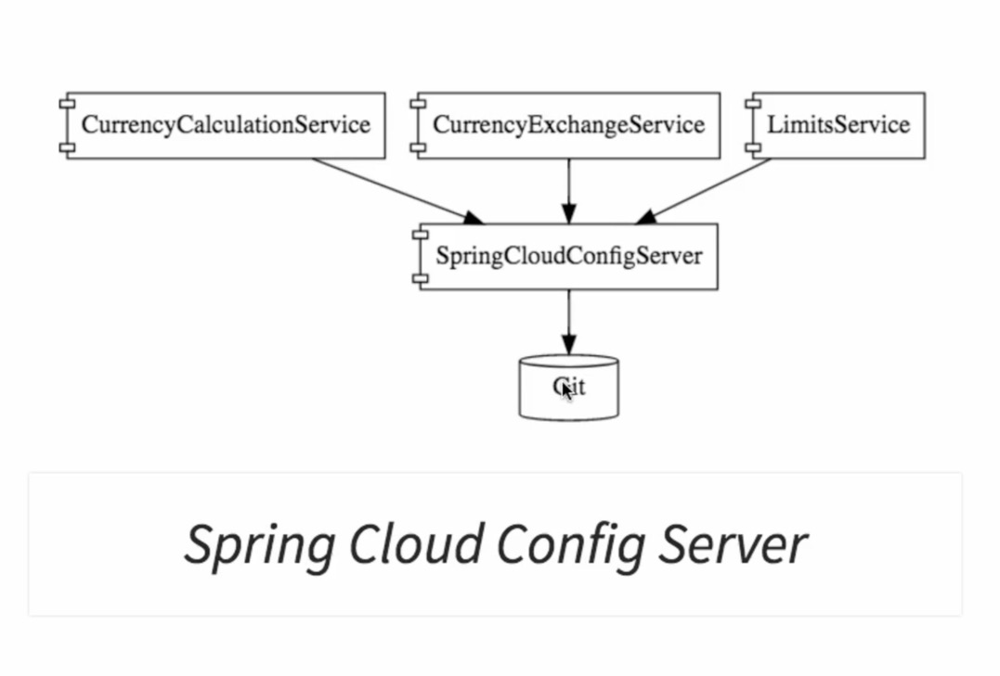
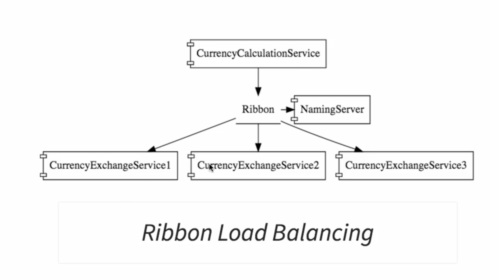

# Exchange-With-Microservices
Project on end-end demonstration of use of microservices.

# Overview
- Different microservices created. As shown in figure below.
1. Currency Calculation
2. Currency Exchange
3. Limit 

- Ribbon is used for load balancing and scaling. It is connected with Eureka naming server for services information.

- For monitoring and visibility Zippin is used. For transfering log messages Rabbit mq is being used.

# Components
- Created different microservices
- Establish communication between microservices
- Enable load balancing, scaling up and down of microservices. 
- Centralize the configuration of microservices with Spring Cloud Config Server
- Implement Eureka Naming Server and Distributed tracing with Spring Cloud Sleuth and Zipkin
- Created fault tolerant microservices with Zipkin.
