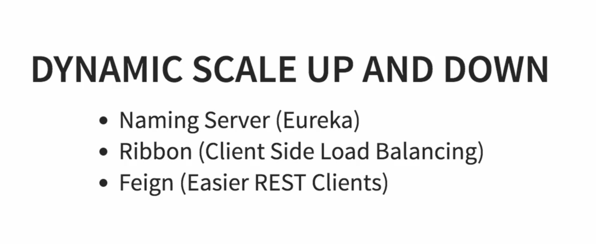
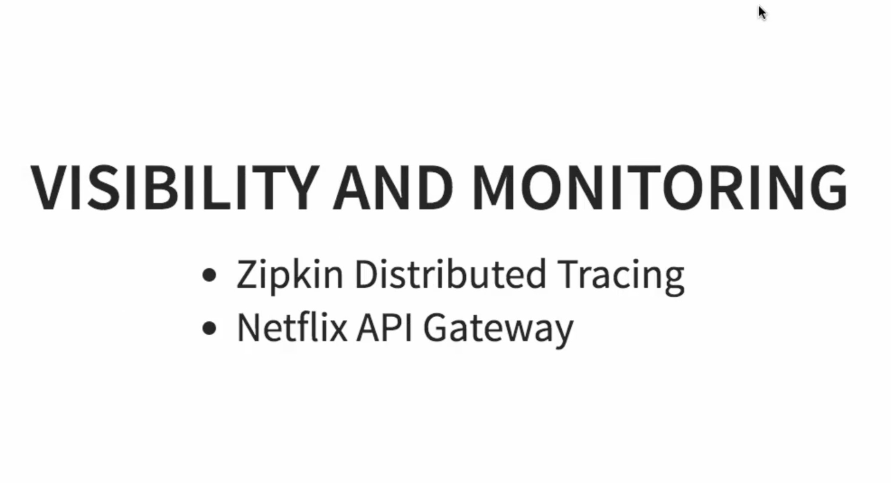

# Exchange-With-Microservices
Project on end-end demonstration of use of microservices.

# Overview
- Different microservices created

- Ribbon for load balancing and scaling

- Zippin for load balancing

# Components
- Created different microservices
- Establish communication between microservices
- Enable load balancing, scaling up and down of microservices. 
- Centralize the configuration of microservices with Spring Cloud Config Server
- Implement Eureka Naming Server and Distributed tracing with Spring Cloud Sleuth and Zipkin
- Created fault tolerant microservices with Zipkin.
